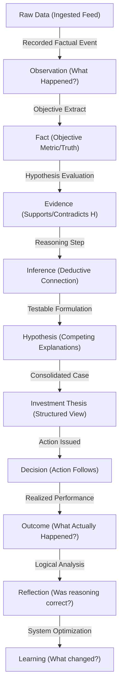

# Athena Data Flow Document

*This document defines the core lifecycle of information in Athena, tracking how raw data evolves into structured knowledge, logical hypotheses, executed decisions, and system learning.*

---

## The Core Cognitive Flow

Athena does not jump from raw data directly to predictions. Instead, it follows a rigorous, multi-stage scientific pipeline:

---

## Detailed Stage Definitions

| Stage | Responsibility | Example |
| :--- | :--- | :--- |
| **Raw Data** | External ingestion source payload. | JSON packet from SEC EDGAR API feed. |
| **Observation** | Record of factual data receipt or event occurrence. | SEC 10-Q filed for AAPL on 2026-07-02. |
| **Fact** | Extracted objective quantitative/qualitative data points. | AAPL Q3 Revenue = $90.8B, Revenue Growth = 18%. |
| **Evidence** | Evaluation of a Fact relative to a target Hypothesis. | AAPL 18% Revenue Growth supports the Expansion Hypothesis. |
| **Inference** | Deductive path connecting multiple Evidences. | (Revenue Growth ↑ + Margin Expansion + Insider buying) indicates conviction. |
| **Hypothesis** | A testable explanation of market behavior. | AAPL is entering an expansionary product supercycle. |
| **Investment Thesis** | Multi-hypothesis debate, risk analysis, and final case. | BUY AAPL, confidence 82%, invalidation if revenue drops below 10%. |
| **Decision** | The actual transaction or recommendation execution. | BUY 100 shares of AAPL at $195.50. |
| **Outcome** | Realized market outcome and performance metrics. | AAPL reached $210.00 (+7.4%) on 2026-08-01. |
| **Reflection** | Post-mortem logical critique of the reasoning path. | Thesis correct on growth, but margin expansion was slower than assumed. |
| **Learning** | Parameter tuning and model logic adjustments. | Reduce the weight of margin assumptions on hardware tech thesis. |
