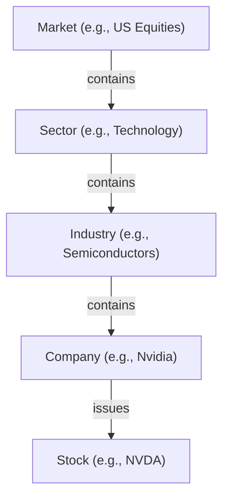
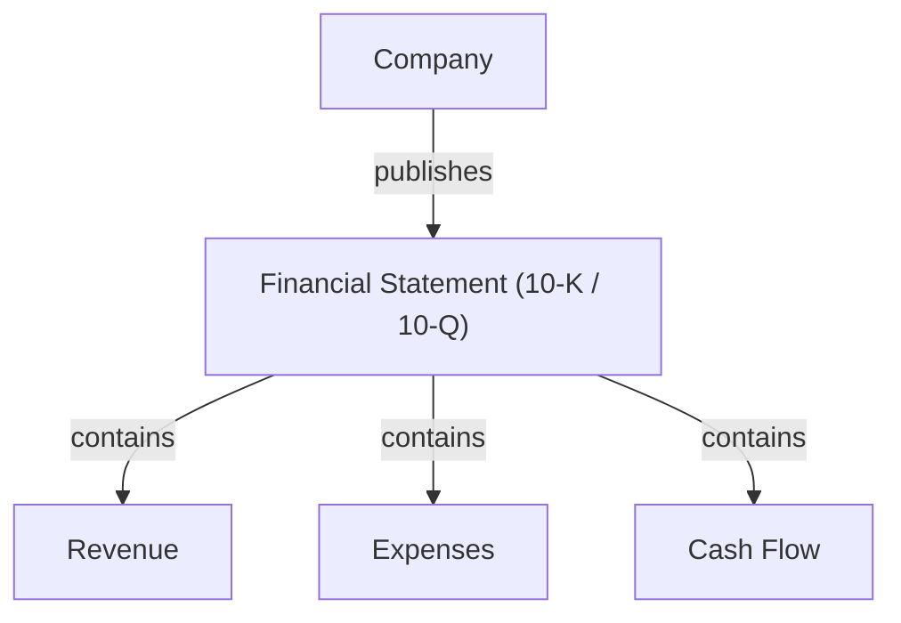
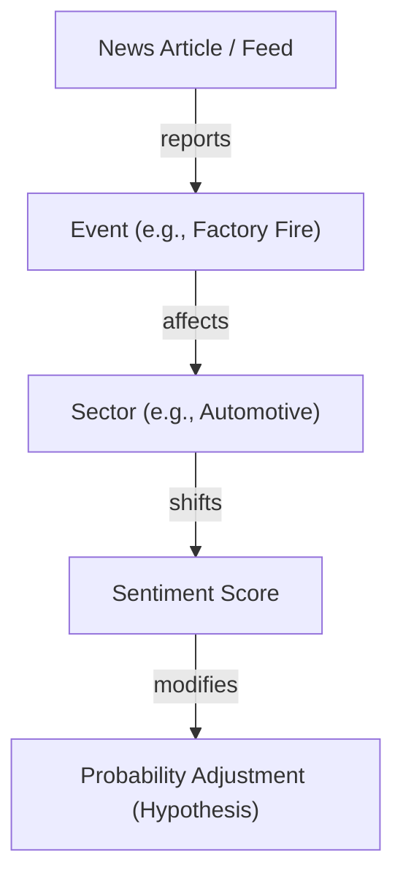

# Athena Domain Ontology

*This document outlines the core structural entities and relationships that define Athena's Knowledge Graph.*

---

## 1. Core Ontologies

### Market Structural Hierarchy
Defines the nesting of financial markets:

### Corporate Financial Model
Defines the data structure of corporate disclosures:

### News & Market Impact Ontology
Defines how unstructured narratives map to quantitative probability adjustments:

---

## 2. Entity Definition Schemas

### Market Hierarchy Entities
* **Market**: Represents a global trading venue or asset class.
* **Sector**: Top-level economic category (GICS/SIC).
* **Industry**: Granular subcategory within a sector.
* **Company**: The corporate legal entity.
* **Stock**: The tradeable equity instrument representing ownership in a Company.

### Disclosures & Financial Entities
* **Financial Statement**: Standardized SEC filings (10-K, 10-Q, 8-K).
* **Financial Metric (Revenue, Expenses, Cash Flow)**: Standardized accounting metrics with currency, period, and value.

### Narrative & Semantic Entities
* **Event**: A discrete real-world occurrence with time, location, and entities involved.
* **Sentiment**: Quantitative score representing tone, confidence, and narrative direction.
* **Probability**: The statistical confidence weight mapping to an active Hypothesis.
